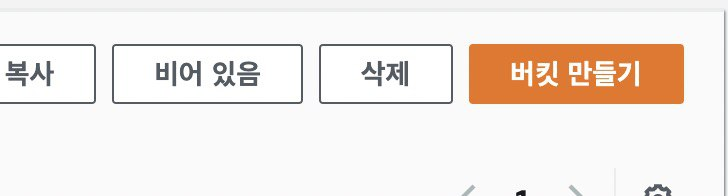
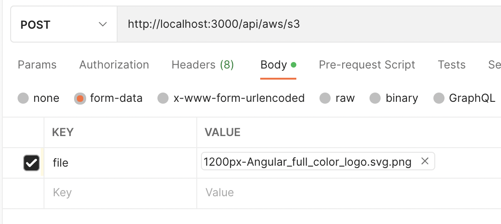
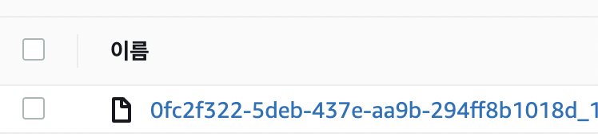

# AWS s3 버킷 생성하기
1) https://s3.console.aws.amazon.com/s3/buckets?region=ap-northeast-2 에 접속합니다.
2) "버킷 만들기" 를 클릭하여 버킷을 생성합니다.<br />

3) 버킷 이름과 버킷의 region을 메모장 등에 기록해둡니다.

<br /><br />

# AWS Access Key & Secret Key 생성하기
1) https://console.aws.amazon.com/iam/ 에 접속합니다.
2) 사용자를 생성 또는 사용자의 보안자격증명으로 이동하여 엑세스 키 만들기를 통해 "액세스 키 ID" 와 "비밀 액세스 키" 를 생성한 뒤 이를 메모장 등에 기록합니다.
3) 사용자에게 아래 권한 정책을 부여합니다.
```
{
  "Version": "2012-10-17",
  "Statement": [
    {
      "Effect": "Allow",
      "Action": [
        "s3:PutObject",
        "s3:PutObjectAcl"
      ],
      "Resource": "arn:aws:s3:::버킷명/*"
    }
  ]
}
```

<br /><br />

# 이 레포지토리를 테스트 해보는 방법
1) git clone 을 받습니다.
```
git clone https://github.com/wisdomstar94/nestjs-aws-s3-upload.git
```
2) clone 받은 레포지토리 폴더로 이동합니다.
```
cd nestjs-aws-s3-upload
```
3) npm install 을 진행합니다.
```
npm i
```
4) .env.sample 파일을 .env 파일로 복사합니다.
```
copy .env.sample .env
```
5) .env 의 내용을 채웁니다.

| 파라미터명 | 설명 |
| -- | -- |
| AWS_S3_BUCKET_NAME | AWS S3에 생성한 버킷 이름을 입력합니다. |
| AWS_ACCESS_KEY_ID | 사용자의 액세스 키 ID를 입력합니다. |
| AWS_SECRET_ACCESS_KEY | 사용자의 비밀 액세스 키를 입력합니다. |
| AWS_REGION | 버킷의 region을 입력합니다. |
6) develop 모드로 프러젝트를 구동합니다.
```
npm run start:dev
```
7) POSTMAN 으로 다음과 같이 API 엔드포인트를 호출합니다.

8) aws s3 버킷에 파일이 올라간 것을 확인 할 수 있습니다.

